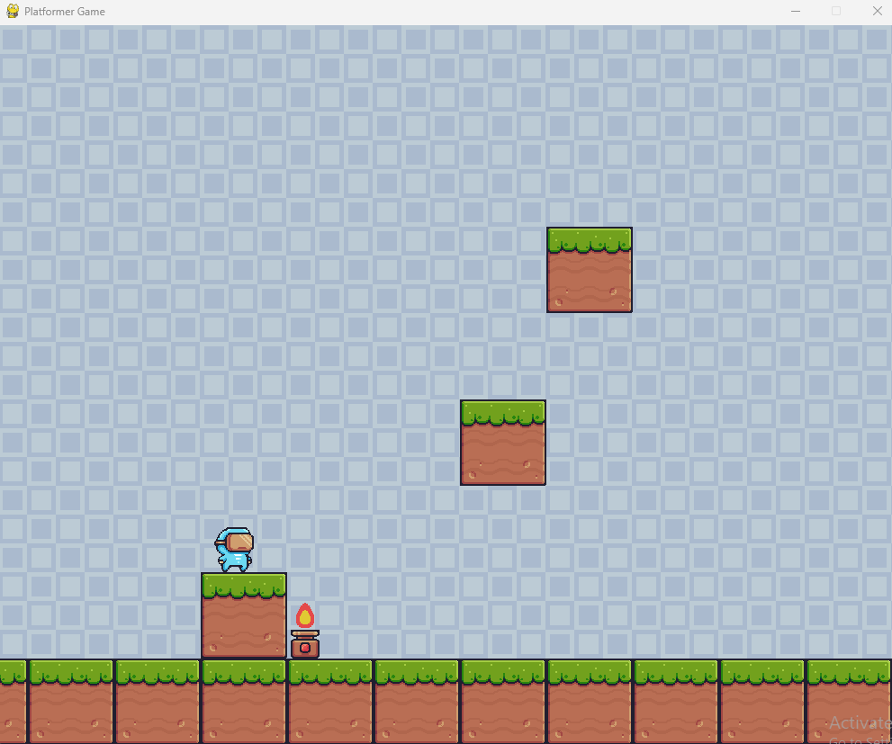
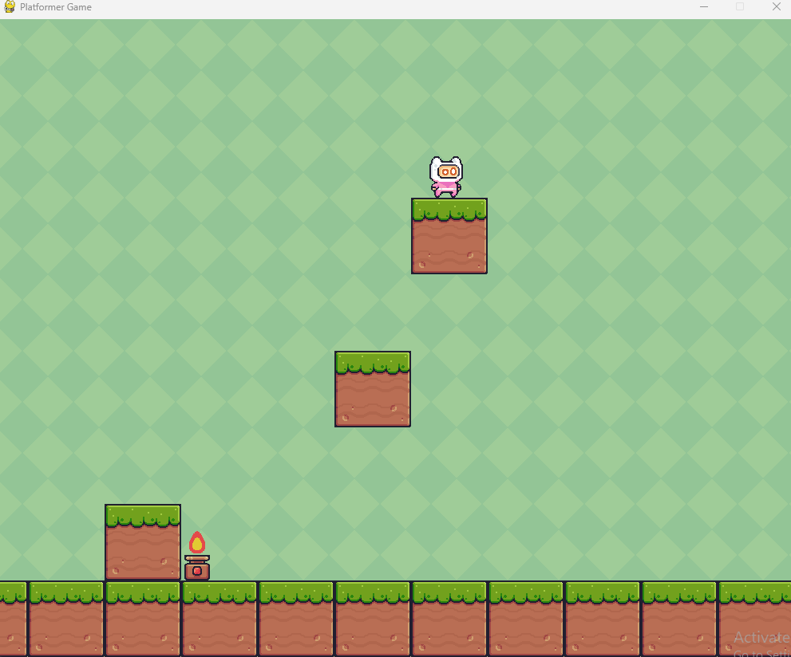

# Mario Platformer Game



## Overview

**Mario Platformer Game** is a 2D platformer game built entirely in Python, featuring classic platform mechanics inspired by retro games like _Super Mario_. Players can control a character to navigate platforms, avoid obstacles, and collect items. The game uses basic game mechanics such as jumping, moving left or right, and interacting with the environment. This game was inspired by the video of my mentor **Tim Ruscica - Tech With Tim**.

## Features

- **Smooth Player Movement**: Move left, right, and jump between platforms.
- **Obstacles**: Avoid objects and traps along the way.
- **Pixel Art**: Features simple and clean pixel-art-based graphics.
- **Python and Pygame**: Fully developed using Python and the Pygame library.

## Installation

### Requirements

- Python 3.x
- Pygame library

### Setup

1. Clone the repository:
   ```bash
   git clone https://github.com/yourusername/mario-platformer-game.git
   ```
2. Navigate to the game directory:
   ```bash
   cd mario-platformer-game
   ```
3. Install the required dependencies:
   ```bash
   pip install pygame
   ```
4. Run the game:
   ```bash
   python main.py
   ```

## How to Play

- Use the **arrow keys** to move the character left or right.
- Press the **spacebar** to jump.
- Avoid obstacles and reach the end of the level.

## Screenshots



## Future Enhancements

- Adding more levels
- Implementing enemy characters
- Power-ups and collectibles
- Improved sound effects
